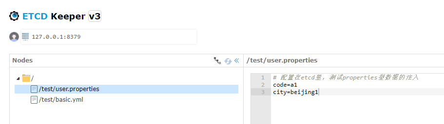

# 配置中心服务端
## 搭建etcd
对外暴露在8379端口
```text
docker run --restart=on-failure -d --publish 8379:2379 --publish 2380:2380 --env ALLOW_NONE_AUTHENTICATION=yes --name etcd01 bitnami/etcd:3.5
```

设置密码，并开启验证
```text
docker exec -it etcd01 /bin/bash
#容器里执行，用户为root，记住设置的密码
etcdctl --endpoints=http://127.0.0.1:2379 user add root  会提示输入密码
etcdctl --endpoints=http://127.0.0.1:2379 auth enable
```

## 搭建etcdkeeper
对外暴露在8381端口，开启etcd鉴权，需要输入密码
```text
docker run --restart=on-failure -d -p 8381:8080 --entrypoint "./etcdkeeper.bin" --name etcdkeeper01 evildecay/etcdkeeper -h 0.0.0.0 -p 8080 -auth
```

在控制台设置正确的etcd的host:port，开启鉴权要输入用户名和密码

